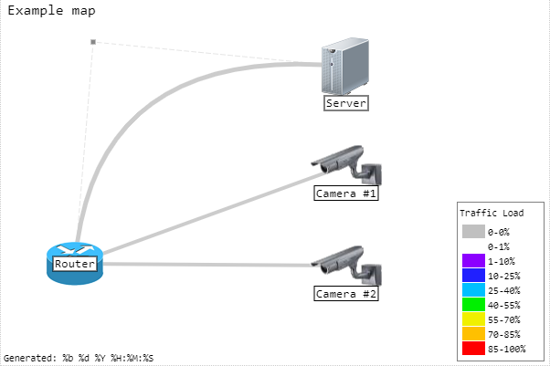

# Librenms Weathermap editor

LibreNMS Weather map editor is an adaptation for LibreNMS of the plugin developed by Vitaly Chekryzhev for editing cacti
weather maps.
 To install use the following commands:

````
  $ git clone git@github.com:edgeuno/WeathermapEditor.git
````

Or

````
$ git clone https://github.com/edgeuno/WeathermapEditor.git
````
### Supports / features

- Easy to drag&drop nodes movement
- Templated nodes and links
- Background color and image
- Convert from and to WeatherMap format
- Load and save to native WeatherMap configs
- Editor for nodes, links, scales, fonts, templates, map properties
- Links with VIA, multiple VIA and curved/angled styles
- Gently handles unsupported tags (excepting templated objects)
- All types of time objects: min/max/generated time
- Display title
- Grid contrasting to background
- Snap to grid
- Scales are drawn in classic style
- Optionally can decrease redraw intense on movement
- SET hidezero and hidepercent for scales
- Import/export map
- Templated view
- multi link asociation


Editor is intended to present object position and links among nodes, custom fonts are not supported as they may be located at inaccessible location.

Links with VIA positions are displayed as bezier line with movable control points. Multiple VIAs are displayed as polyline.





*Last 2 images taken from 13hakta blog*
## Configuration

Move into the WeathermapEditor/editor directory and make a copy of setup.inc.default.php named setup.inc.php. This file
will hold all of your local configuration parameters.

```
cd WeathermapEditor/editor
sudo cp setup.inc.default.php setup.inc.php
```

The following parameters must be configured:

- librenms_base
- mapdir
- imgdir

It is assumed that the Weathermap plugin is already installed.

### librenms_base

Real path for the LibreNMS installation

```injectablephp
$librenms_base = realpath(dirname(__FILE__) . '/../../../../');
```

### mapdir

Path for the directory where the map configuration files are going to be saved

```injectablephp
$mapdir = $librenms_base . '/html/plugins/Weathermap/configs';
```

### imgdir

Path for the directory where the images are going to be saved

```injectablephp
$imgdir = $librenms_base . '/html/plugins/Weathermap/images';
```

----

# Original Readme

GUI JS Weathermap editor. Integrates into CACTI as a plugin, but can work separately. NB: Restrict access to php script
with .htaccess or similar ways.

Put wmeditor folder to CACTI plugon folder.

If changes were made then run ./build.sh to prepare distro.

Vitaly Chekryzhev <13hakta@gmail.com>, 2017-2018
https://13hakta.ru

# Thanks

- To Edgeuno for the support, visit at https://edgeuno.com/
- To 13hakta for the work, visit at https://13hakta.ru

# Links

- Release blog post for the cacti plugin https://13hakta.ru/blog/wmap.html
- Repository for the cacti plugin https://gitlab.com/13hakta/wmeditor
